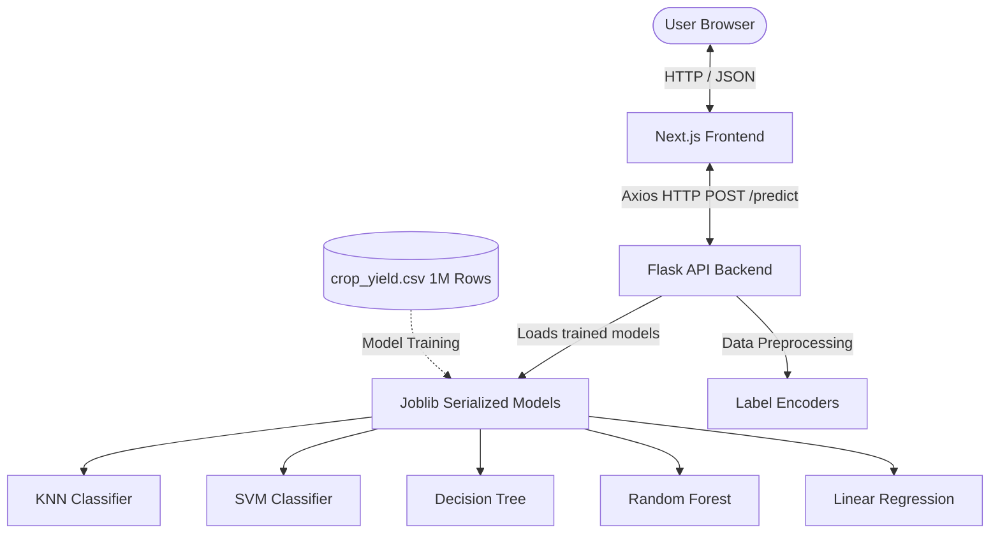

# 🌾 Crop Yield Predictor & SML Model Analyzer

A full-stack, end-to-end Machine Learning web application designed to predict crop yields and evaluate supervised machine learning models. The application utilizes classification models to predict yield categories (Low, Medium, High) and a regression model to estimate exact crop yield in tons per hectare. It features an interactive Next.js dashboard containing dynamic visualizations of model predictions, classification probabilities, and accuracy metrics.

---

## 🏗️ Architecture



---

## 🛠️ Complete Tech Stack

### 1. Frontend Client (Deployed on Vercel)
- **Core Framework**: [Next.js 16.0.1](https://nextjs.org/) (React 19.2.0, TypeScript)
- **Styling**: [Tailwind CSS v4](https://tailwindcss.com/) for fluid, modern layouts and UI components
- **Data Visualization**: [Recharts v3.3.0](https://recharts.org/) for responsive classification probability and model accuracy charts
- **API Integration**: [Axios](https://github.com/axios/axios) for network requests to the ML backend

### 2. Backend API (Deployed on Render/Railway)
- **Web Framework**: [Flask](https://flask.palletsprojects.com/) (Python 3)
- **CORS Handling**: `Flask-CORS` to enable secure cross-origin requests from the client
- **Serialization**: `Joblib` for saving and loading pre-trained Scikit-Learn models and Label Encoders

### 3. Machine Learning & Data Pipeline
- **Libraries**: `Scikit-Learn`, `Pandas`, `NumPy`
- **Data Preprocessing**: `LabelEncoder` (for encoding `Crop` and `Region` fields)
- **Classification Models** (Yield Categorization: Low, Medium, High):
  - **K-Nearest Neighbors (KNN)** (`n_neighbors=5`)
  - **Support Vector Machine (SVM)** (`kernel='rbf'`, `probability=True`)
  - **Decision Tree Classifier**
  - **Random Forest Classifier** (`n_estimators=100`)
- **Regression Model** (Exact Yield Estimation):
  - **Linear Regression**
- **Evaluation & Visualization**: `Matplotlib` & `Seaborn` (for generating confusion matrices and accuracy plots)

### 4. Dataset
- **Dataset**: `crop_yield.csv` (1,000,000 rows, ~93.4 MB)
- **Features Used**:
  - `Rainfall_mm` (Numerical)
  - `Temperature_Celsius` (Numerical)
  - `Irrigation_Used` (Binary/Boolean)
  - `Fertilizer_Used` (Binary/Boolean)
  - `Crop_enc` (Encoded Categorical: Cotton, Rice, Barley, Soybean, Wheat, Maize)
  - `Region_enc` (Encoded Categorical: West, East, North, South)
- **Targets**:
  - `Yield_Class` (Low [<= 33% quantile], Medium, High [> 66% quantile])
  - `Yield_tons_per_hectare` (Continuous target for Regression)

---

## 📁 Directory Structure

```text
SMLPROJECT/
├── backend/                   # Python Flask API & Models
│   ├── models/                # Pre-trained .pkl models used by Flask
│   ├── app.py                 # Flask server entrypoint & predict route
│   ├── utils.py               # Data loading, encoding, splitting utility
│   ├── requirements.txt       # Backend dependencies for production host
│   └── train_small_models.py  # Production model trainer
├── frontend/                  # Next.js Frontend Dashboard
│   ├── src/
│   │   └── app/
│   │       ├── page.tsx       # Interactive calculator and Recharts layout
│   │       └── globals.css    # Tailwind styles
│   ├── package.json           # Frontend dependencies
│   └── vercel.json            # Vercel deployment options
├── crop_yield.csv             # The main 1M rows dataset (~93.4 MB)
├── DEPLOYMENT.md              # Detailed hosting & deployment notes
├── requirements.txt           # Global python dependencies
└── .gitignore                 # Custom git exclude rules for large ML files
```

---

## ⚙️ Local Setup & Running

### 1. Backend Server Setup
From the repository root, set up the Python virtual environment and run the Flask app:

```bash
# Create and activate Python virtual environment
python3 -m venv .venv
source .venv/bin/activate

# Install requirements
pip install -r requirements.txt

# Run the training scripts to generate model pickles (Optional if files exist in backend/models)
python3 train_models.py
python3 train_regression.py

# Start the Flask API
cd backend
python3 app.py
```
The backend API will run on `http://127.0.0.1:5000`.

### 2. Frontend Client Setup
In a new terminal window, navigate to the frontend directory:

```bash
cd frontend

# Install package dependencies
npm install

# Copy env template
cp .env.example .env.local

# Run Next.js dev server
npm run dev
```
The frontend dashboard will be available at `http://localhost:3000`.

---

## ⚠️ CRITICAL DEPLOYMENT INFO: GitHub & Hosting Memory Limits

Before attempting to deploy the application, please read this section carefully to prevent deployment crashes and Git push errors.

### 1. GitHub 100MB File Size Limit
* **Problem**: GitHub rejects files larger than 100MB. The default trained **`RandomForest_model.pkl` is ~1.85 GB**, which exceeds this limit by over 18x! Committing this file directly to Git will cause your push to fail.
* **Solution**: The root `.gitignore` is pre-configured to ignore all `models/`, `backend/models/`, and `.pkl` files. **Do not commit these files to GitHub.**

### 2. Free Tier Hosting RAM Limits (512MB RAM)
* **Problem**: Free tiers on Render, Railway, or Fly.io restrict standard web service RAM to **512MB**. Loading the 1.85 GB Random Forest model, the 88 MB KNN model, and processing the 93 MB CSV in Pandas requires **more than 2.5 GB of RAM**. Your backend service will crash immediately due to Out of Memory (OOM) errors.
* **How to fix this for free tier deployment**:
  We recommend retraining a **compact/lightweight version** of the models using a smaller subset of the data:
  
  Modify your training parameters in your training scripts or run the included downsampler script inside the `backend/` directory:
  ```bash
  cd backend
  python3 train_small_models.py
  ```
  This creates lightweight `.pkl` files under 5MB combined, which load quickly and use less than 100MB of RAM.

---

## 🚀 How to Deploy the Application (Different Platforms)

Because the project is composed of a **React/Next.js frontend** and a **Python/Flask ML backend**, they should be deployed on their respective optimized platforms:

### Step 1: Deploy the Flask Backend API (on Render or Railway)
1. Push your project code (without the large `.pkl` files and `crop_yield.csv`, which are ignored by `.gitignore`) to a GitHub repository.
2. Go to [Render](https://render.com/) or [Railway](https://railway.app/).
3. Create a new **Web Service** and connect your GitHub repository.
4. Configure the service settings:
   - **Root Directory**: `backend`
   - **Runtime**: `Python`
   - **Build Command**: `pip install -r requirements.txt`
   - **Start Command**: `gunicorn app:app` (Make sure you ran `train_small_models.py` locally first to generate light model pickles).
5. Deploy and copy the public URL provided (e.g., `https://crop-yield-backend.onrender.com`).

### Step 2: Deploy the Next.js Frontend (on Vercel)
1. Sign up on [Vercel](https://vercel.com/).
2. Click **Add New** -> **Project** and select your GitHub repository.
3. In the configuration window:
   - **Root Directory**: Select `frontend` (Crucial!).
   - **Framework Preset**: Next.js.
   - **Environment Variables**: Add a new variable:
     * **Key**: `NEXT_PUBLIC_API_URL`
     * **Value**: Your hosted backend URL from Step 1 (e.g., `https://crop-yield-backend.onrender.com`).
4. Click **Deploy**. Vercel will automatically build and publish your React-based Next.js frontend!
